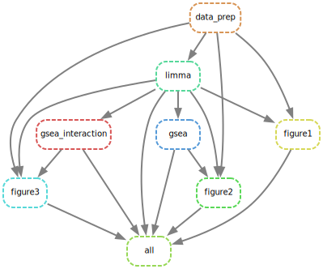
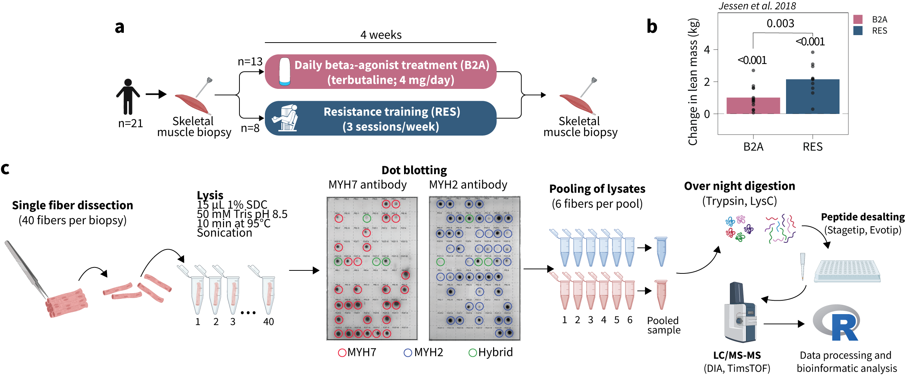
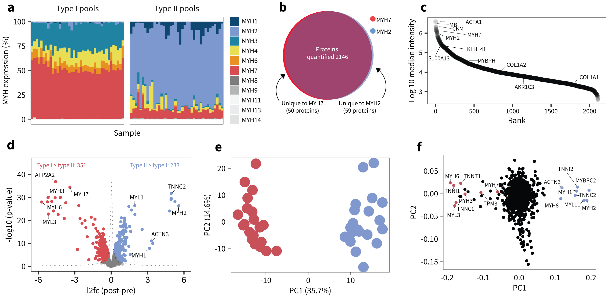
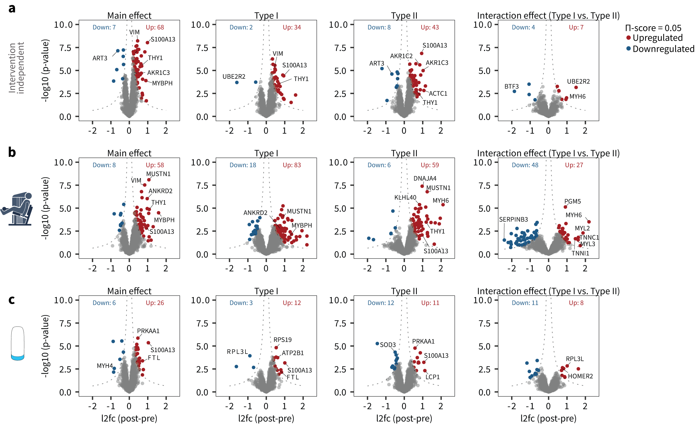
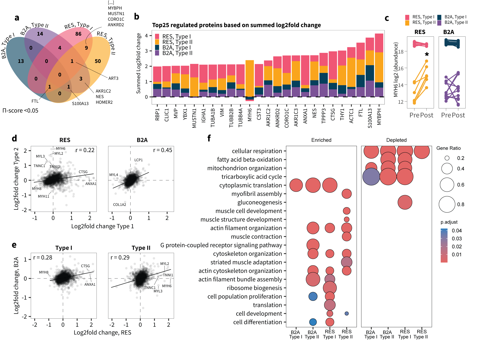
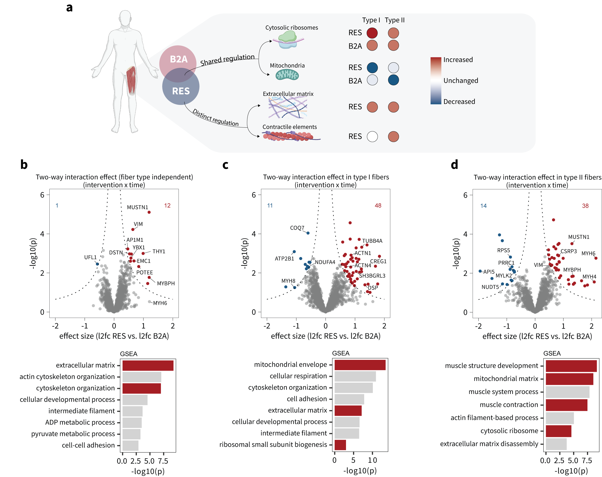
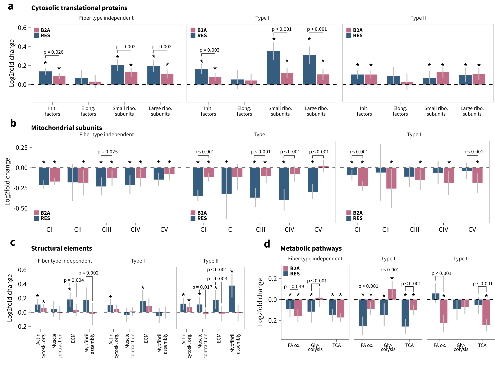

# 🐳 Snakemake + Docker Pipeline for Proteomics Analysis

This repository contains the code and data to reproduce the analysis from an unpublished study on β2-agonist treatment combined with resistance training and their effects on the skeletal muscle proteome in
type I and IIa muscle fibers, respectively.

The repository is designed to be executed as a **Snakemake workflow** inside a **Docker container**. Inside the docker container, [`renv`](https://rstudio.github.io/renv/) manages R package dependencies. In this way, the project is reproducible and easily useable across systems. 

You do **not need to install R or any R packages** locally — everything is self-contained within the Docker image.

## 🚀 Quick Start (Run the Analysis in Docker)

To reproduce the full analysis in a portable and reproducible environment:

### 1. 📥 Clone the repository
```bash
git clone https://github.com/s-jessen/manuscript_beta2_single_fiber.git
cd manuscript_beta2_single_fiber
```

### 2. 🐳 Install Docker (if not already installed)
```
#Linux:
sudo pacman -S docker
sudo systemctl start docker
```
On macOS or Windows, download from [`Docker website`](https://www.docker.com/products/docker-desktop/)

### 3. 📦 Download the docker image
```
docker pull sorenjessen/b2a_res_single_fiber:latest
```

### 4. ▶️ Run the analysis from within the root of the repository

This command will mount your local 'raw-data' (input data), 'R' (scripts), and 'data' (output files such as Figures etc.) folders into the container and run the full pipeline:
```
## ----- On linux/mac ----- ##
bash run_docker_unix.sh

## ----- On Windows ----- ##
#You may need to run PowerShell as admin and run
Set-ExecutionPolicy -Scope Process -ExecutionPolicy Bypass

#...followed by
./run_docker_win.ps1

```

This will automatically:

- Mount the necessary folders (data-raw, R, data)
- Run the Snakemake workflow with 1 fewer core than your system’s total
- Write the output to the local data/ folder

You can modify the analysis scripts in the local R/ folder and rerun the command. The pipeline will automatically rerun only the necessary steps based on file dependencies.



### 📁 Project Folder Structure

This project follows a reproducible research structure using the `prodigenr` framework. Below is an overview of the folder layout and purpose of key files:

```
├── data                                    # Output of scripts (GSEA results, statistics, etc.)
│   ├── figures                             # Folder to store figures
│   └── ...                                 # RDS files, tables, etc.
├── data-raw                                # Raw input data
│   ├── design.xlsx                         # Metadata file
│   ├── keywords.xlsx                       # Uniprot keywords for gene annotation
│   ├── mitocarta.xls                       # MitoCarta 3.0 gene annotation
│   └── proteomic_data.csv                  # Raw proteomic intensity data
├── DESCRIPTION                             # Metadata and dependencies for R package structure
├── Dockerfile                              # Docker recipe to build reproducible container
├── docs                                    # Manuscript figures
├── environment.yml                         # Conda environment file (for Snakemake, Python tools)
├── manuscript_beta2_single_fiber_snakemake.Rproj # R project file (not necessary for Docker workflow)
├── R                                       # R analysis scripts
│   ├── data_preparation.R                  # Cleans raw data and stores SummarizedExperiment
│   ├── figure1.R                           # Code producing figure 1 plots
│   ├── figure2.R                           # Code producing figure 2 plots
│   ├── figure3.R                           # Code producing figure 3 plots
│   ├── functions.R                         # Functions
│   ├── gsea_interaction.R                  # Runs GSEA (gene set enrichment analysis) for interaction results
│   ├── gsea.R                              # Runs GSEA 
│   ├── limma.R                             # Differential expression using limma
│   └── settings.R                          # Plotting themes, color palettes, etc.
├── README.md                               # This file.
├── renv                                    # renv infrastructure
│   └── ...
├── renv.lock                               # Exact R package versions
├── run_in_docker_container.sh              # Bash script initiating snakemake pipeline in Docker container
├── snakefile                               # Bash script to launch pipeline in Docker
└── workflow.svg                            # DAG of pipeline
```

The R project contains code to reproduce the following highlighted figures:







